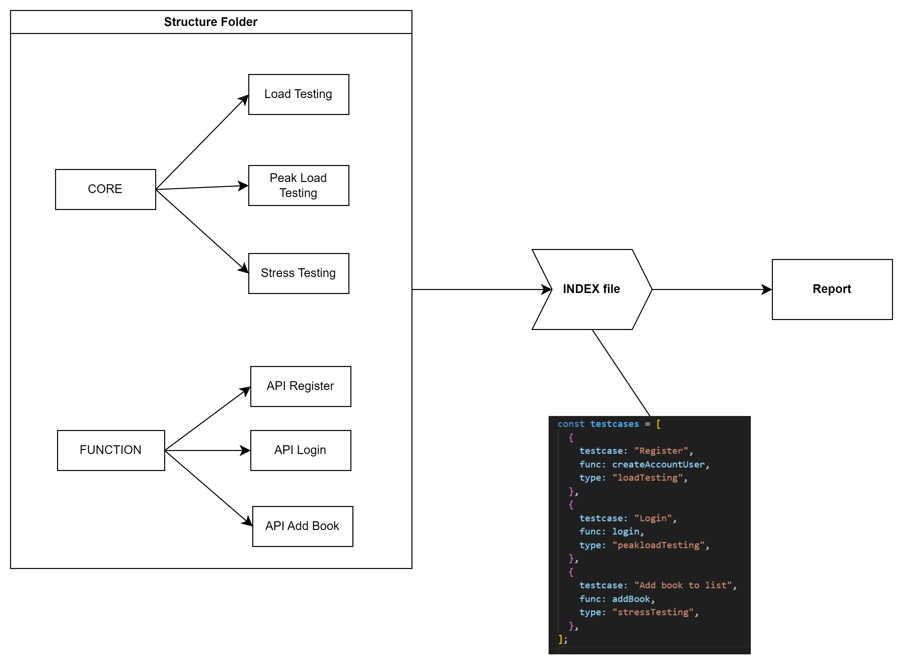

# Performance Testing with AXIOS

#### Project website link: https://demoqa.com 

---

## Technology:  

- Environment: Node.js  
- Library: Axios  
- Build tool: npm  
- Language: Javascript  
- Report: Custom report using Excel 
- IDE: Visual Studio Code  

---

## Project Architecture:  

---

## Test scenario: 

<ol>
<li>Automate Register Function</li>

- Peak load testing: Register 100 accounts simultaneously
- Load testing: Register 10 accounts per second for a duration of 5 minutes
- Stress testing: Register 10 accounts at a time, with a 3-second interval between each batch, repeated 5 times

<li>Automate Login Function</li>

- Peak load testing: Login 100 accounts simultaneously
- Load testing: Login 100 accounts per second for a duration of 5 minutes
- Stress testing: Login 100 accounts at a time, with a 3-second interval between each batch, repeated 5 times

<li>Automate Add Book to List Function</li>

- Peak load testing: 100 users adding books to their profiles simultaneously
- Load testing: 10 users adding books to their profiles every second for a duration of 5 minutes
- Stress testing: 10 users adding books to their profiles at once, with a 3-second interval between each batch, repeated 5 times

</ol>

---

## Run the Automation Script:

1. Open cmd to the project folder using VS Code
2. Type this command:
   npm run dev
3. After Complete the test execution Report will generate to reports Folder

---

## Test Report:

